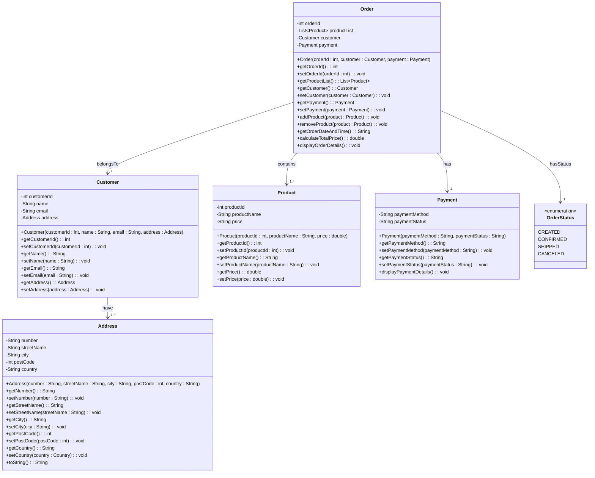

```mermaid
classDiagram
    class Customer {
        -int customerId
        -String name
        -String email
        -Address address
        +Customer(customerId : int, name : String, email : String, address : Address)
        +getCustomerId() : int
        +setCustomerId(customerId : int) : void
        +getName() : String
        +setName(name : String) : void
        +getEmail() : String
        +setEmail(email : String) : void
        +getAddress() : Address
        +setAddress(address : Address) : void
    }
    class Product {
        -int productId
        -String productName
        -String price
        +Product(productId : int, productName : String, price : double)
        +getProductId() : int
        +setProductId(productId : int) : void
        +getProductName() : String
        +setProductName(productName : String) : void
        +getPrice() : double
        +setPrice(price : double) : void
    }
    class Order {
        -int orderId
        -List~Product~ productList
        -Customer customer
        -Payment payment
        +Order(orderId : int, customer : Customer, payment : Payment)
        +getOrderId() : int
        +setOrderId(orderId : int) : void
        +getProductList() : List~Product~
        +getCustomer() : Customer
        +setCustomer(customer : Customer) : void
        +getPayment() : Payment
        +setPayment(payment : Payment) : void
        +addProduct(product : Product) : void
        +removeProduct(product : Product) : void
        +getOrderDateAndTime() : String
        +calculateTotalPrice() : double
        +displayOrderDetails() : void
    }
    class Address {
        -String number
        -String streetName
        -String city
        -int postCode
        -String country
        +Address(number : String, streetName : String, city : String, postCode : int, country : String)
        +getNumber() : String
        +setNumber(number : String) : void
        +getStreetName() : String
        +setStreetName(streetName : String) : void
        +getCity() : String
        +setCity(city : String) : void
        +getPostCode() : int
        +setPostCode(postCode : int) : void
        +getCountry() : String
        +setCountry(country : Country) : void
        +toString() : String
    }
    class Payment {
        -String paymentMethod
        -String paymentStatus
        +Payment(paymentMethod : String, paymentStatus : String)
        +getPaymentMethod() : String
        +setPaymentMethod(paymentMethod : String) : void
        +getPaymentStatus() : String
        +setPaymentStatus(paymentStatus : String) : void
        +displayPaymentDetails() : void
    }
    class OrderStatus {
        <<enumeration>>
        CREATED
        CONFIRMED
        SHIPPED
        CANCELED
    }
    
   Order --> "1" Customer : belongsTo
   Order --> "1..*" Product : contains
   Customer --> "1..*" Address : have
   Order --> "1" Payment : has
   Order --> "1" OrderStatus : hasStatus
```
